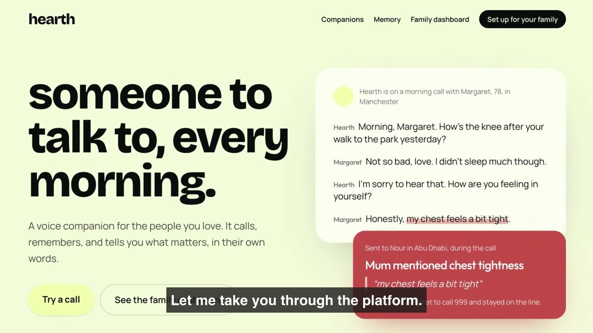

# hearth

Voice AI companions that remember you. Built at Fish Tank (Hub71, Abu Dhabi).

**Live:** https://hearth-assistant.vercel.app

## Demo

[](docs/hearth-demo.mp4)

▶ [Watch the 2-minute demo](docs/hearth-demo.mp4) (1080p, with subtitles)

Hearth calls the people you love for a warm daily chat, remembers their stories, and tells the family what matters, with the exact words behind every alert. The same engine powers four companions:

| Companion | For | Who sees the summary |
|---|---|---|
| **Daily check-in** | Older people living alone | Family dashboard, with quotes and trends |
| **After a loss** | Anyone who is grieving | Private |
| **Between sessions** | People in trauma therapy (grounding only, never digs into the past) | Private, with an optional note for their therapist |
| **Right now** | Panic and anxiety in the moment | Private |

Every companion shares:

- **One shared memory per person**: after every call, a Claude memory agent updates what Hearth knows (people in their life, health, what triggers or helps them, routines, the languages they mix) and what to check on next time. Every companion reads it, so the grief companion knows about yesterday's panic call.
- **Calm mode**: slows down with short sentences and guided breathing when someone is overwhelmed.
- **Crisis handoff**: red flags bring up local emergency and support numbers straight away, and the family is alerted during the call.
- **Any language, any mix**: Hearth mirrors how you speak (Hinglish stays Hinglish; Arabic with English and French stays that mix). Family quotes keep the original words with an English translation.

Hearth is a companion, not therapy or medical care, and it never diagnoses.

## Run it locally

Requires Node.js 22+.

```bash
npm install
vercel link                      # connect to the Vercel project (Neon Postgres is attached there)
vercel env pull .env.local --yes # database connection settings
# add OPENAI_API_KEY and ANTHROPIC_API_KEY to .env.local (see .env.example)
npm run db:migrate               # create the tables (safe to re-run)
npm run dev
```

Open http://localhost:3000. Voice calls need a browser with microphone access (Chrome recommended).

| Variable | Used for |
|---|---|
| `OPENAI_API_KEY` | Live voice conversation (OpenAI Realtime) |
| `ANTHROPIC_API_KEY` | Call analysis, family dashboard and private notes (Claude) |
| `DATABASE_URL`, `DATABASE_URL_UNPOOLED` | Neon Postgres (added by `vercel env pull`) |

## Pages

| Path | What it is |
|---|---|
| `/` | Homepage |
| `/companions` | Pick a companion |
| `/call?c=checkin` | Daily check-in call (also `loss`, `sessions`, `rightnow`) |
| `/dashboard` | Family dashboard for the daily check-in |
| `/setup` | Enter the person's name, language, location and emergency numbers |
| `/memory` | What Hearth remembers about a person: facts you can forget one by one, follow-ups, a calendar of conversations and full transcripts. `?view=family` shows only the daily check-in |

Everything you see comes from real calls: there's no sample data. Start at `/setup` to tell Hearth who the daily check-in is for. **"Clear check-ins"** on the dashboard empties it (with a confirmation); memory is managed on `/memory`.

## How it works

- **Voice and live reasoning:** OpenAI `gpt-realtime-2.1` (speech to speech, low reasoning effort) over WebRTC, with semantic turn-taking and far-field noise reduction. The server mints a short-lived key so the real API key never reaches the browser (`app/api/session`). User speech is transcribed with `gpt-transcribe`.
- **Personalities:** each companion's instructions are rebuilt before every call from what Hearth remembers (`lib/companion.ts`, `lib/companions.ts`).
- **Live tools:** `set_calm_mode` and `escalate`, handled in the browser (`components/call/CallScreen.tsx`).
- **After the call:** Claude (`claude-opus-5`) reads the transcript plus recent history and returns structured, quote-backed signals for the family (`app/api/analyze`) or a private note for the caller (`app/api/reflect`).
- **Memory agent:** `lib/memory.ts` runs alongside each call's note, merges new facts into the person's memory, and builds the memory each companion sees. Anything learned in a private companion never reaches the family check-in or dashboard.
- **Storage:** Neon Postgres via the Vercel Marketplace. Schema in `db/schema.sql` (tables: `settings`, `people`, `conversations`, `checkins`, `alerts`), applied with `npm run db:migrate` over the direct connection. The app uses the pooled connection through `pg` with Vercel's `attachDatabasePool` (`lib/db.ts`, `lib/store.ts`). It starts empty and fills only from real calls. People are identified by first name for now.
- **Trends:** a person's "normal" speaking pace is learned from their own earlier calls (after two), never assumed.

## Demo notes

- Emergency and support numbers are pre-filled per country on the setup page; check them before relying on them.
- The "Call" buttons on crisis screens are deliberately not `tel:` links, so a click on stage can't dial a real emergency line.

Stack: Next.js 16 (App Router), React 19, Tailwind CSS v4, TypeScript.
